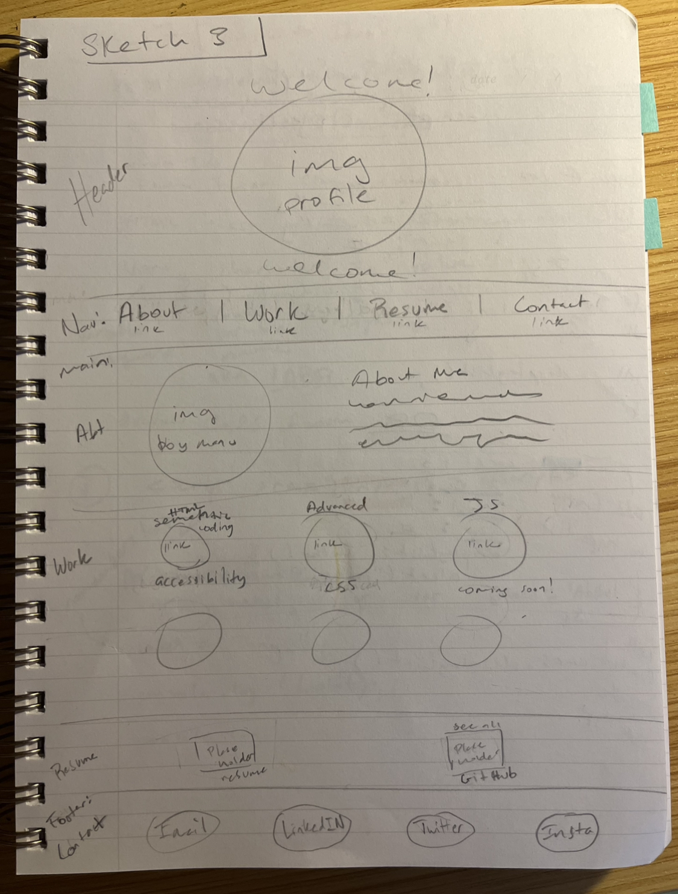

# Manuela's Coding Portfolio
Week 2 Challenge Focus: putting my Advanced CSS skills into practice!

## Description

This project is intended to show my understanding of building my first webpage from scratch using my knowledge of HTML and advanced CSS code. The webpage is a portfolio of all the coding work I have done so far as well as the projects I will be doing in the future to present to potential employers. 

The webpage is based off the original sketch I made here:

    ```md
    
    ```
See the usage portion to see what it's all about!

## Installation

N/A

## Usage

When you open the page it will load a large picture of me with the message "Welcome!". right below is the `<nav>` bar of all the sections in my portfolio, where you can hover over the any light-purple word (which turns green) and it will jump to a new section on the page. My "about me" has an image of baby me and a blurb of text below. Under that has all of my work with images and titles, where if you hover over an image it will expand showing the link attached to it, which will take you to the deployed site of that project. Below that is a "see more" section which has image links to my resume and my GitHub profile. The footer is its own `<nav>` bar and it has all of my contact info including my social media. Inspect more by opening Google Chrome DevTools or any other code inspection tool on your default browser to view the HTML and CSS setups.  

## Credits

[Placeholder.com for the Horiseon and resume image!](https://placeholder.com/)
[ImageLR for the color pallet I used based on my main photo at the top!](https://imagelr.com/)
[I ran with the top answer to get the circle crop working](https://stackoverflow.com/questions/26421274/css-circular-cropping-of-rectangle-image)
[Where I got my GitHub image!](https://github.com/logos)
[How I learned to make links jump to a specific part of a page](https://www.w3docs.com/snippets/html/how-to-create-an-anchor-link-to-jump-to-a-specific-part-of-a-page.html)
[Where I learned the `<hr>` tag. Used the circle image cropper to make the lines fade](https://www.w3schools.com/howto/howto_css_dividers.asp)
[A little review on `:hover` but I got the direct answer to enlarge an image by using transform](https://stackoverflow.com/questions/43288553/image-enlarge-on-hover)
Used these two images as inspiration:
[sample-site](https://i.ytimg.com/vi/6cidbUHNZRQ/maxresdefault.jpg)
[A visual on how screens should look](https://tse2.mm.bing.net/th?id=OIP.CabUO8g_fBp4uFRsDeo3xwHaDv&pid=Api)
[This clarified the box model but for some reason my borders wouldn't show! Future debugging :)](https://www.w3schools.com/Css/css_boxmodel.asp)

I also got my bowtie cat image directly from the prework assignment. I used mac and iphone for magic cropping tools, but that's it. I own my images haha

## License
Please refer to the LICENSE in the repo.

---


